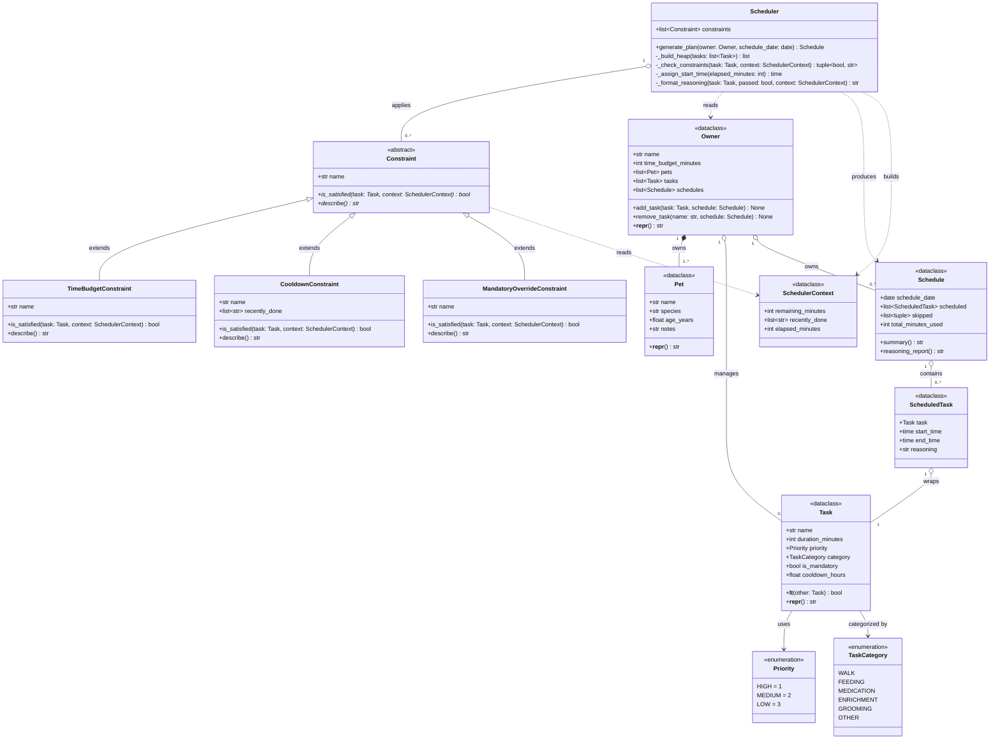

# PawPal+ UML Class Diagram

```mermaid
classDiagram

    %% ─────────────────────────────────────────────
    %% ENUMERATIONS
    %% ─────────────────────────────────────────────

    class Priority {
        <<enumeration>>
        HIGH = 1
        MEDIUM = 2
        LOW = 3
    }

    class TaskCategory {
        <<enumeration>>
        WALK
        FEEDING
        MEDICATION
        ENRICHMENT
        GROOMING
        OTHER
    }

    %% ─────────────────────────────────────────────
    %% CORE DATA MODELS
    %% ─────────────────────────────────────────────

    class Task {
        <<dataclass>>
        +str name
        +int duration_minutes
        +Priority priority
        +TaskCategory category
        +bool is_mandatory
        +float cooldown_hours
        +__lt__(other: Task) bool
        +__repr__() str
    }

    class Pet {
        <<dataclass>>
        +str name
        +str species
        +float age_years
        +str notes
        +__repr__() str
    }

    class Owner {
        <<dataclass>>
        +str name
        +int time_budget_minutes
        +list~Pet~ pets
        +list~Task~ tasks
        +list~Schedule~ schedules
        +add_task(task: Task, schedule: Schedule) None
        +remove_task(name: str, schedule: Schedule) None
        +__repr__() str
    }

    %% ─────────────────────────────────────────────
    %% SCHEDULE OUTPUT MODELS
    %% ─────────────────────────────────────────────

    class ScheduledTask {
        <<dataclass>>
        +Task task
        +time start_time
        +time end_time
        +str reasoning
    }

    class Schedule {
        <<dataclass>>
        +date schedule_date
        +list~ScheduledTask~ scheduled
        +list~tuple~ skipped
        +int total_minutes_used
        +summary() str
        +reasoning_report() str
    }

    %% ─────────────────────────────────────────────
    %% CONSTRAINT SYSTEM
    %% ─────────────────────────────────────────────

    class SchedulerContext {
        <<dataclass>>
        +int remaining_minutes
        +list~str~ recently_done
        +int elapsed_minutes
    }

    class Constraint {
        <<abstract>>
        +str name
        +is_satisfied(task: Task, context: SchedulerContext) bool*
        +describe() str*
    }

    class TimeBudgetConstraint {
        +str name
        +is_satisfied(task: Task, context: SchedulerContext) bool
        +describe() str
    }

    class CooldownConstraint {
        +str name
        +list~str~ recently_done
        +is_satisfied(task: Task, context: SchedulerContext) bool
        +describe() str
    }

    class MandatoryOverrideConstraint {
        +str name
        +is_satisfied(task: Task, context: SchedulerContext) bool
        +describe() str
    }

    %% ─────────────────────────────────────────────
    %% SCHEDULER (CORE ENGINE)
    %% ─────────────────────────────────────────────

    class Scheduler {
        +list~Constraint~ constraints
        +generate_plan(owner: Owner, schedule_date: date) Schedule
        -_build_heap(tasks: list~Task~) list
        -_check_constraints(task: Task, context: SchedulerContext) tuple~bool, str~
        -_assign_start_time(elapsed_minutes: int) time
        -_format_reasoning(task: Task, passed: bool, context: SchedulerContext) str
    }

    %% ─────────────────────────────────────────────
    %% RELATIONSHIPS
    %% ─────────────────────────────────────────────

    Owner "1" *-- "1..*" Pet : owns
    Owner "1" o-- "0..*" Task : manages
    Owner "1" o-- "0..*" Schedule : owns
    Task --> Priority : uses
    Task --> TaskCategory : categorized by
    ScheduledTask "1" o-- "1" Task : wraps
    Schedule "1" o-- "0..*" ScheduledTask : contains
    Constraint <|-- TimeBudgetConstraint : extends
    Constraint <|-- CooldownConstraint : extends
    Constraint <|-- MandatoryOverrideConstraint : extends
    Scheduler "1" o-- "0..*" Constraint : applies
    Scheduler ..> Owner : reads
    Scheduler ..> Schedule : produces
    Scheduler ..> SchedulerContext : builds
    Constraint ..> SchedulerContext : reads
```
